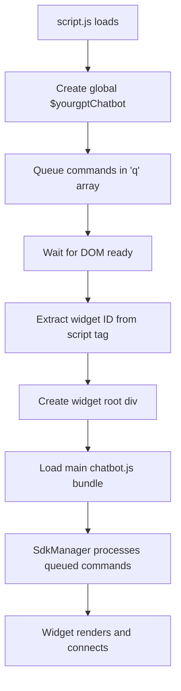

# YourGPT React SDK - In-Depth Function Reference

## Overview

The YourGPT React SDK provides a modern, type-safe way to integrate YourGPT's chatbot widget into React applications. Built on top of the existing widget infrastructure, it offers hooks-based APIs for seamless React integration.

## Architecture Deep Dive

### Core System Flow

```
script.js → SdkManager → AI Actions SDK → Socket Manager → Widget UI
    ↓          ↓              ↓             ↓           ↓
  Queue     Process       Register      Network     Render
Commands   Actions       Handlers      Events      Updates
```

### Current Implementation Analysis

The SDK leverages your existing infrastructure:

1. **Script.js** (`/public/script.js`) - Widget loader and global API initialization
2. **SdkManager.tsx** - Command processing, event handling, and state management
3. **AI Actions SDK** (`/src/widget/utils/aiActionsSdk.ts`) - AI action management layer
4. **AI Actions Store** (`/src/widget/store/aiActionsStore.ts`) - Zustand-based state management
5. **Socket Manager** - Real-time communication with backend services

### Initialization Flow



## Installation

```bash
npm install @yourgpt/react-sdk
```

## Script.js Analysis - Global API Foundation

### Function: `YOURGPT_CHATBOT_SDK.initScript()`

**Purpose**: Initialize the widget loader and set up the global API.

**Detailed Flow**:
1. **Document Detection**: Checks if `document` exists (SSR safety)
2. **Script Tag Discovery**: Searches for `#yourgpt-chatbot` or `#ygc-chatbot`
3. **Endpoint Selection**: Chooses between standard or whitelabel endpoints
4. **Widget ID Extraction**: Gets widget ID from multiple sources:
   - `window.YGC_WIDGET_ID` (programmatic)
   - `data-widget` attribute
   - `widget` attribute
5. **Asset Loading**: Dynamically loads CSS and JS bundles
6. **DOM Setup**: Creates root container with highest z-index
7. **Module Loading**: Loads main chatbot bundle as ES module

**Global API Setup**:
```javascript
window.$yourgptChatbot = {
  q: [],                    // Command queue
  execute: function(),      // Execute widget actions
  on: function(),          // Register event listeners
  off: function(),         // Unregister event listeners
  set: function()          // Set widget data
}
```

**Error Handling**:
- Missing document → Early return with log
- Missing script tag → Warning but continues
- Missing widget ID → Error and early return
- Missing body tag → Error and early return

### Command Queue System

**Purpose**: Handle commands before widget fully loads.

**Mechanism**:
1. Commands are pushed to `q` array
2. Each command is `[action, method, ...args]` format
3. SdkManager processes queue when ready
4. Global API is replaced with real handlers

## SdkManager.tsx Analysis - Command Processing Engine

### Core Architecture

```typescript
// Command Types
type Action = "set" | "execute" | "on" | "off" | "registerAIAction";
type Method = "init" | "widget:open" | "widget:close" | "widget:popup" | 
              "widget:show" | "widget:hide" | "message:send" | 
              "bottomSheet:open" | "bottomSheet:close" | "escalatedToHuman" | 
              "game:start";

// State Management
const listeners: Listener = {};           // Event listeners registry
const sessionSetQueue: any[] = [];       // Session data queue
const visitorSetQueue: any[] = [];       // Visitor data queue
const contactSetQueue: any[] = [];       // Contact data queue
```

### Function: `handleSet(method, arg)`

**Purpose**: Process "set" commands for data management.

**Detailed Behavior**:

#### Session Data Setting (`session:data`)
```typescript
// Flow:
if (method === "session:data") {
  if (activeSession?.session_uid) {
    // Immediate send via socket
    socketManager.setSessionData({
      widget_uid: widgetUid,
      session_uid: activeSession.session_uid,
      data: arg
    });
  } else {
    // Queue for later processing
    sessionSetQueue.push({ data: arg });
  }
}
```

**React SDK Usage**:
```typescript
// Hook implementation
const setSessionData = useCallback((data: object) => {
  window.$yourgptChatbot?.set('session:data', data);
}, []);

// User usage
chatbot.setSessionData({
  userId: "123",
  plan: "premium",
  preferences: { theme: "dark" }
});
```

#### Visitor Data Setting (`visitor:data`)
```typescript
// Flow:
if (method === "visitor:data") {
  if (visitorUid) {
    // Immediate send
    socketManager.setVisitorData({
      widget_uid: widgetUid,
      visitor_uid: visitorUid,
      data: arg
    });
  } else {
    // Queue for later
    visitorSetQueue.push({ data: arg });
  }
}
```

**React SDK Usage**:
```typescript
// Analytics and tracking data
chatbot.setVisitorData({
  source: "google",
  campaign: "summer2024",
  pageViews: 5,
  timeOnSite: 180
});
```

#### Contact Data Setting (`contact:data`)
```typescript
// Flow:
if (method === "contact:data") {
  // Validation: Email OR phone required
  if (!arg?.email?.trim() && !arg?.phone?.trim()) {
    console.error("To set contact data, email or phone is required");
    return;
  }
  
  // Handle user_hash for identity
  if (arg?.user_hash) {
    setUserHash(arg.user_hash);
  }
  
  // Send or queue
  if (visitorUid) {
    socketManager.setContactData({
      widget_uid: widgetUid,
      visitor_uid: visitorUid,
      data: arg
    });
  } else {
    contactSetQueue.push({ data: arg });
  }
}
```

**React SDK Usage**:
```typescript
// User identification
chatbot.setContactData({
  email: "user@example.com",
  name: "John Doe",
  phone: "+1234567890",
  user_hash: "secure-hash-for-identity"
});
```

### Function: `handleExecute(method, args)`

**Purpose**: Execute widget actions and operations.

#### Widget Control Commands

**`widget:open`**
```typescript
// Internal flow:
toggleChatbotPopup(true);

// React SDK usage:
const open = useCallback(() => {
  window.$yourgptChatbot?.execute('widget:open');
}, []);
```

**`widget:close`**
```typescript
// Internal flow:
toggleChatbotPopup(false);

// React SDK usage:
const close = useCallback(() => {
  window.$yourgptChatbot?.execute('widget:close');
}, []);
```

**`widget:show`** / **`widget:hide`**
```typescript
// Internal flow:
setChatbotVisible(true/false);

// React SDK usage:
const show = () => window.$yourgptChatbot?.execute('widget:show');
const hide = () => window.$yourgptChatbot?.execute('widget:hide');
```

#### Message Sending (`message:send`)
```typescript
// Internal flow:
if (args?.text) {
  setExecution({
    data: {
      text: args.text,
      send: args.send    // Auto-send flag
    },
    type: "message:send"
  });
  toggleChatbotPopup(true);  // Auto-open chat
}

// React SDK usage:
const sendMessage = useCallback((text: string, autoSend = true) => {
  window.$yourgptChatbot?.execute('message:send', { text, send: autoSend });
}, []);
```

#### Bottom Sheet Operations (`bottomSheet:open`)
```typescript
// Internal flow:
bottomSheetContext.openBottomSheet({ 
  render: "url", 
  data: { url: args.url } 
});

// React SDK usage:
const openBottomSheet = useCallback((url: string) => {
  window.$yourgptChatbot?.execute('bottomSheet:open', { url });
}, []);
```

#### Game Integration (`game:start`)
```typescript
// Internal flow:
const { id, showExitConfirmation, leadCapture, gameConfig } = args;

// Game type mapping:
switch (id) {
  case "bouncyBird":
    gameContext.playGame({ gameId: GameType.BOUNCY_BIRD, showExitConfirmation });
    break;
  case "emojiRiddle":
    gameContext.playGame({ gameId: GameType.EMOJI_RIDDLE, showExitConfirmation });
    break;
  case "guessMoji":
    gameContext.playGame({ 
      gameId: GameType.GUESS_MOJI, 
      showExitConfirmation, 
      leadCapture, 
      gameConfig 
    });
    break;
  case "quizMania":
    gameContext.playGame({ 
      gameId: GameType.QUIZ_MANIA, 
      showExitConfirmation, 
      leadCapture, 
      gameConfig 
    });
    break;
}

// React SDK usage:
const startGame = useCallback((gameId: string, options = {}) => {
  window.$yourgptChatbot?.execute('game:start', { id: gameId, ...options });
}, []);
```

### Function: `handleOn(method, handler)` / `handleOff(method, handler)`

**Purpose**: Event listener management.

#### AI Action Event Handling
```typescript
// Internal flow for AI actions:
if (method.startsWith("ai:action:")) {
  const actionName = method.replace("ai:action:", "");
  aiActionsSdk.on(actionName, handler);  // or .off()
  return;
}

// Regular event handling:
if (typeof handler === "function") {
  listeners[method] = [...(listeners[method] || []), handler];
}
```

#### Event Types and Triggers

**`init`** - Fired when socket connects
```typescript
// Internal trigger:
useEffect(() => {
  if (socketConnected) {
    const init = listeners.init || [];
    init.forEach(callback => callback());
  }
}, [socketConnected]);

// React SDK usage:
useEffect(() => {
  chatbot.onInit(() => {
    console.log('Widget initialized and ready');
  });
}, []);
```

**`widget:popup`** - Fired when widget opens/closes
```typescript
// Internal trigger:
useEffect(() => {
  const widgetPopup = listeners["widget:popup"] || [];
  widgetPopup.forEach(callback => callback(chatbotPopup));
}, [chatbotPopup]);

// React SDK usage:
useEffect(() => {
  chatbot.onWidgetPopup((isOpen) => {
    console.log('Widget is', isOpen ? 'open' : 'closed');
  });
}, []);
```

**`message:received`** - Fired when message arrives
```typescript
// Internal trigger:
useEffect(() => {
  if (socketConnected) {
    socketManager.socket.on(SocketListenE.messageReceived, handleMessageReceived);
  }
}, [socketConnected]);

const handleMessageReceived = useCallback((data: any) => {
  const messageReceived = listeners["message:received"] || [];
  messageReceived.forEach(callback => callback(data));
}, []);

// React SDK usage:
useEffect(() => {
  chatbot.onMessageReceived((data) => {
    console.log('New message:', data);
    // Handle notifications, analytics, etc.
  });
}, []);
```

**`escalatedToHuman`** - Fired when chat mode changes to human
```typescript
// Internal trigger:
const handleModeChanged = useCallback((data: any) => {
  if (data?.chat_mode !== undefined) {
    const newMode = Object.values(ChatBotModeE).find(mode => mode === data.chat_mode);
    
    if (newMode === ChatBotModeE.awaiting) {
      const escalatedToHumanListeners = listeners["escalatedToHuman"] || [];
      escalatedToHumanListeners.forEach(callback => {
        callback({
          ...data,
          mode: newMode,
          modeKey: Object.keys(ChatBotModeE).find(key => 
            ChatBotModeE[key as keyof typeof ChatBotModeE] === newMode
          )
        });
      });
    }
  }
}, []);

// React SDK usage:
useEffect(() => {
  chatbot.onEscalatedToHuman((data) => {
    console.log('Escalated to human agent:', data);
    // Show notification, update UI, etc.
  });
}, []);
```

### Queue Processing System

**Purpose**: Handle commands sent before widget is fully loaded.

#### Session Queue Processing
```typescript
useEffect(() => {
  if (activeSession?.session_uid) {
    while (sessionSetQueue.length > 0) {
      const data = sessionSetQueue.shift();
      socketManager.setSessionData({
        widget_uid: widgetUid,
        session_uid: activeSession.session_uid,
        ...data
      });
    }
  }
}, [activeSession, widgetUid]);
```

#### Visitor Queue Processing
```typescript
useEffect(() => {
  if (visitorUid) {
    while (visitorSetQueue.length > 0) {
      const data = visitorSetQueue.shift();
      socketManager.setVisitorData({
        widget_uid: widgetUid,
        visitor_uid: visitorUid,
        ...data
      });
    }
  }
}, [visitorUid, widgetUid]);
```

#### Contact Queue Processing
```typescript
useEffect(() => {
  if (visitorUid) {
    while (contactSetQueue.length > 0) {
      const data = contactSetQueue.shift();
      socketManager.setContactData({
        widget_uid: widgetUid,
        visitor_uid: visitorUid,
        ...data
      });
    }
  }
}, [visitorUid, widgetUid]);
```

### AI Actions Integration

**Purpose**: Handle AI-powered actions from the chatbot.

#### Socket Event Handling
```typescript
useEffect(() => {
  if (socketConnected) {
    // Set widget UID for AI actions
    aiActionsSdk.setWidgetUid(widgetUid);
    
    // Listen for AI actions from server
    socketManager.socket.on(SocketListenE.aiAction, (data: ActionRecData) => {
      aiActionsSdk.handleAction(data);
    });
  }
  
  return () => {
    socketManager.socket.off(SocketListenE.aiAction);
  };
}, [socketConnected, widgetUid]);
```

#### AI Action Registration
```typescript
// In handleOn for AI actions:
if (method.startsWith("ai:action:")) {
  const actionName = method.replace("ai:action:", "");
  aiActionsSdk.on(actionName, handler);
}

// React SDK usage:
const aiActions = useAIActions();
aiActions.registerAction('get_location', async (data, helpers) => {
  const confirmed = await helpers.confirm({
    title: 'Location Access',
    description: 'Allow location access?'
  });
  
  if (confirmed) {
    // Get location and respond
    helpers.respond(`Location: ${lat}, ${lng}`);
  } else {
    helpers.respond('Location access denied');
  }
});
```

## Quick Start Guide

### 1. Initialize SDK

```typescript
// main.tsx or App.tsx
import { YourGPT } from '@yourgpt/react-sdk';

YourGPT.init({
  widgetId: 'your-widget-id',
  endpoint: '', // optional
  autoLoad: true, // optional
  debug: false // optional
});
```

### 2. Basic Usage

```typescript
import { useYourGPTChatbot } from '@yourgpt/react-sdk';

function ChatButton() {
  const chatbot = useYourGPTChatbot();

  return (
    <button onClick={chatbot.open}>
      Open Chat
    </button>
  );
}
```

## React SDK Implementation Plan

### YourGPT.init(config) - Entry Point

**Purpose**: Initialize the React SDK and set up the widget infrastructure.

**Implementation**:
```typescript
class YourGPTSDK {
  private static instance: YourGPTSDK;
  private config: YourGPTConfig | null = null;
  private isInitialized = false;

  static init(config: YourGPTConfig) {
    if (!this.instance) {
      this.instance = new YourGPTSDK();
    }
    return this.instance.initialize(config);
  }

  private initialize(config: YourGPTConfig) {
    this.config = config;
    this.isInitialized = true;
    
    // Mirror script.js behavior
    window.YOURGPT_WIDGET_UID = config.widgetId;
    window.$yourgptChatbot = {
      ...(window.$yourgptChatbot || {}),
      WIDGET_ENDPOINT: config.endpoint || '',
    };

    // Optionally load widget immediately
    if (config.autoLoad !== false) {
      this.loadWidget();
    }

    return this;
  }

  private loadWidget() {
    // Dynamic loading logic similar to script.js
    const endpoint = this.config?.endpoint || '';
    
    // Create root container
    if (!document.getElementById('yourgpt_root')) {
      const root = document.createElement('div');
      root.style.zIndex = '99999999999';
      root.style.position = 'fixed';
      root.id = 'yourgpt_root';
      document.body?.appendChild(root);
    }

    // Load CSS
    if (!document.querySelector(`link[href="${endpoint}/chatbot.css"]`)) {
      const link = document.createElement('link');
      link.rel = 'stylesheet';
      link.href = `${endpoint}/chatbot.css`;
      document.head?.appendChild(link);
    }

    // Load JS bundle
    if (!document.querySelector(`script[src="${endpoint}/chatbot.js"]`)) {
      const script = document.createElement('script');
      script.src = `${endpoint}/chatbot.js`;
      script.async = true;
      script.type = 'module';
      document.head?.appendChild(script);
    }
  }
}
```

**Configuration Options**:
```typescript
interface YourGPTConfig {
  widgetId: string;        // Required: Your widget ID
  endpoint?: string;       // Optional: Custom endpoint
  autoLoad?: boolean;      // Optional: Auto-load widget (default: true)
  debug?: boolean;         // Optional: Enable debug mode (default: false)
  whitelabel?: boolean;    // Optional: Use whitelabel endpoint
}
```

**Usage Example**:
```typescript
// main.tsx or App.tsx
YourGPT.init({
  widgetId: 'eb2a98b4-0809-4b5a-9134-bef1166af8fb',
  endpoint: '',
  autoLoad: true,
  debug: process.env.NODE_ENV === 'development'
});
```

### useYourGPTChatbot() - Core Widget Hook

**Purpose**: Provide React-friendly access to all widget functionality.

**Implementation**:
```typescript
export function useYourGPTChatbot() {
  const [state, setState] = useState<ChatbotState>({
    isOpen: false,
    isVisible: true,
    isConnected: false,
    isLoaded: false,
  });

  // Widget control functions
  const widgetControls = useMemo(() => ({
    open: () => window.$yourgptChatbot?.execute('widget:open'),
    close: () => window.$yourgptChatbot?.execute('widget:close'),
    toggle: () => {
      if (state.isOpen) {
        window.$yourgptChatbot?.execute('widget:close');
      } else {
        window.$yourgptChatbot?.execute('widget:open');
      }
    },
    show: () => window.$yourgptChatbot?.execute('widget:show'),
    hide: () => window.$yourgptChatbot?.execute('widget:hide'),
  }), [state.isOpen]);

  // Messaging functions
  const messaging = useMemo(() => ({
    sendMessage: (text: string, autoSend = true) => {
      window.$yourgptChatbot?.execute('message:send', { text, send: autoSend });
    },
  }), []);

  // Advanced features
  const advanced = useMemo(() => ({
    openBottomSheet: (url: string) => {
      window.$yourgptChatbot?.execute('bottomSheet:open', { url });
    },
    startGame: (gameId: string, options = {}) => {
      window.$yourgptChatbot?.execute('game:start', { id: gameId, ...options });
    },
  }), []);

  // Data management
  const dataManagement = useMemo(() => ({
    setSessionData: (data: object) => {
      window.$yourgptChatbot?.set('session:data', data);
    },
    setVisitorData: (data: object) => {
      window.$yourgptChatbot?.set('visitor:data', data);
    },
    setContactData: (data: object) => {
      window.$yourgptChatbot?.set('contact:data', data);
    },
  }), []);

  // Event listeners
  const eventListeners = useMemo(() => ({
    onInit: (callback: () => void) => {
      window.$yourgptChatbot?.on('init', callback);
      return () => window.$yourgptChatbot?.off('init', callback);
    },
    onMessageReceived: (callback: (data: any) => void) => {
      window.$yourgptChatbot?.on('message:received', callback);
      return () => window.$yourgptChatbot?.off('message:received', callback);
    },
    onEscalatedToHuman: (callback: (data: any) => void) => {
      window.$yourgptChatbot?.on('escalatedToHuman', callback);
      return () => window.$yourgptChatbot?.off('escalatedToHuman', callback);
    },
    onWidgetPopup: (callback: (isOpen: boolean) => void) => {
      window.$yourgptChatbot?.on('widget:popup', callback);
      return () => window.$yourgptChatbot?.off('widget:popup', callback);
    },
  }), []);

  // State synchronization
  useEffect(() => {
    // Listen for state changes
    const unsubscribePopup = eventListeners.onWidgetPopup((isOpen) => {
      setState(prev => ({ ...prev, isOpen }));
    });

    const unsubscribeInit = eventListeners.onInit(() => {
      setState(prev => ({ ...prev, isConnected: true, isLoaded: true }));
    });

    return () => {
      unsubscribePopup();
      unsubscribeInit();
    };
  }, [eventListeners]);

  return {
    // State
    ...state,
    // Functions
    ...widgetControls,
    ...messaging,
    ...advanced,
    ...dataManagement,
    ...eventListeners,
  };
}
```

### useAIActions() - AI Actions Hook

**Purpose**: Manage AI action registration and handling.

**Implementation**:
```typescript
export function useAIActions() {
  const handlersRef = useRef<Map<string, AIActionHandler>>(new Map());
  const [registeredActions, setRegisteredActions] = useState<string[]>([]);

  // Register an AI action
  const registerAction = useCallback((actionName: string, handler: AIActionHandler) => {
    // Store locally
    handlersRef.current.set(actionName, handler);
    
    // Register with global SDK
    window.$yourgptChatbot?.on(`ai:action:${actionName}`, handler);
    
    // Update state
    setRegisteredActions(Array.from(handlersRef.current.keys()));
  }, []);

  // Unregister an AI action
  const unregisterAction = useCallback((actionName: string) => {
    // Remove locally
    handlersRef.current.delete(actionName);
    
    // Unregister from global SDK
    window.$yourgptChatbot?.off(`ai:action:${actionName}`);
    
    // Update state
    setRegisteredActions(Array.from(handlersRef.current.keys()));
  }, []);

  // Get registered actions
  const getRegisteredActions = useCallback(() => {
    return Array.from(handlersRef.current.keys());
  }, []);

  // Batch register multiple actions
  const registerActions = useCallback((actions: Record<string, AIActionHandler>) => {
    Object.entries(actions).forEach(([name, handler]) => {
      registerAction(name, handler);
    });
  }, [registerAction]);

  // Cleanup on unmount
  useEffect(() => {
    return () => {
      // Clean up all registered handlers
      handlersRef.current.forEach((_, actionName) => {
        window.$yourgptChatbot?.off(`ai:action:${actionName}`);
      });
      handlersRef.current.clear();
    };
  }, []);

  return {
    registerAction,
    unregisterAction,
    registerActions,
    getRegisteredActions,
    registeredActions,
  };
}
```

### Function Mapping: Current vs React SDK

| Current Implementation | React SDK Equivalent | Description |
|---|---|---|
| `window.$yourgptChatbot.execute('widget:open')` | `chatbot.open()` | Opens widget popup |
| `window.$yourgptChatbot.execute('widget:close')` | `chatbot.close()` | Closes widget popup |
| `window.$yourgptChatbot.execute('widget:show')` | `chatbot.show()` | Shows widget button |
| `window.$yourgptChatbot.execute('widget:hide')` | `chatbot.hide()` | Hides widget button |
| `window.$yourgptChatbot.execute('message:send', {text, send})` | `chatbot.sendMessage(text, autoSend)` | Sends message |
| `window.$yourgptChatbot.execute('bottomSheet:open', {url})` | `chatbot.openBottomSheet(url)` | Opens bottom sheet |
| `window.$yourgptChatbot.execute('game:start', {id, ...options})` | `chatbot.startGame(gameId, options)` | Starts game |
| `window.$yourgptChatbot.set('session:data', data)` | `chatbot.setSessionData(data)` | Sets session data |
| `window.$yourgptChatbot.set('visitor:data', data)` | `chatbot.setVisitorData(data)` | Sets visitor data |
| `window.$yourgptChatbot.set('contact:data', data)` | `chatbot.setContactData(data)` | Sets contact data |
| `window.$yourgptChatbot.on('init', callback)` | `chatbot.onInit(callback)` | Listens for init |
| `window.$yourgptChatbot.on('message:received', callback)` | `chatbot.onMessageReceived(callback)` | Listens for messages |
| `window.$yourgptChatbot.on('escalatedToHuman', callback)` | `chatbot.onEscalatedToHuman(callback)` | Listens for escalation |
| `window.$yourgptChatbot.on('widget:popup', callback)` | `chatbot.onWidgetPopup(callback)` | Listens for popup state |
| `window.$yourgptChatbot.on('ai:action:actionName', handler)` | `aiActions.registerAction('actionName', handler)` | Registers AI action |
| `window.$yourgptChatbot.off('ai:action:actionName')` | `aiActions.unregisterAction('actionName')` | Unregisters AI action |

### Complete API Reference

#### YourGPT.init(config)

Initialize the SDK with configuration options.

**Parameters**:
```typescript
interface YourGPTConfig {
  widgetId: string;        // Required: Your widget ID
  endpoint?: string;       // Optional: Custom endpoint
  autoLoad?: boolean;      // Optional: Auto-load widget (default: true)
  debug?: boolean;         // Optional: Enable debug mode (default: false)
  whitelabel?: boolean;    // Optional: Use whitelabel endpoint
}
```

**Example**:
```typescript
YourGPT.init({
  widgetId: 'eb2a98b4-0809-4b5a-9134-bef1166af8fb',
  endpoint: '',
  autoLoad: true,
  debug: process.env.NODE_ENV === 'development'
});
```

### useYourGPTChatbot()

Hook for controlling the chatbot widget.

#### Returns

```typescript
interface ChatbotAPI {
  // State
  isOpen: boolean;
  isVisible: boolean;
  isConnected: boolean;
  isLoaded: boolean;

  // Widget Controls
  open: () => void;
  close: () => void;
  toggle: () => void;
  show: () => void;
  hide: () => void;

  // Messaging
  sendMessage: (text: string, autoSend?: boolean) => void;

  // Advanced Features
  openBottomSheet: (url: string) => void;
  startGame: (gameId: string, options?: GameOptions) => void;

  // Data Management
  setSessionData: (data: object) => void;
  setVisitorData: (data: object) => void;
  setContactData: (data: object) => void;

  // Event Listeners
  onInit: (callback: () => void) => () => void;
  onMessageReceived: (callback: (data: any) => void) => () => void;
  onEscalatedToHuman: (callback: (data: any) => void) => () => void;
  onWidgetPopup: (callback: (isOpen: boolean) => void) => () => void;
}
```

#### Detailed Function Behaviors

**Widget Control Functions:**

- **`open()`**: Opens the chatbot popup window
  - **Internal**: Calls `toggleChatbotPopup(true)` in SdkManager
  - **State Update**: Sets `isOpen` to `true`
  - **Side Effects**: May trigger `onWidgetPopup` callbacks

- **`close()`**: Closes the chatbot popup window
  - **Internal**: Calls `toggleChatbotPopup(false)` in SdkManager
  - **State Update**: Sets `isOpen` to `false`
  - **Side Effects**: May trigger `onWidgetPopup` callbacks

- **`toggle()`**: Toggles the chatbot popup state
  - **Logic**: Calls `close()` if open, `open()` if closed
  - **State-Aware**: Uses current `isOpen` state to determine action

- **`show()`**: Shows the widget button/trigger
  - **Internal**: Calls `setChatbotVisible(true)` in SdkManager
  - **State Update**: Sets `isVisible` to `true`
  - **Use Case**: Re-enable widget after hiding

- **`hide()`**: Hides the widget button/trigger
  - **Internal**: Calls `setChatbotVisible(false)` in SdkManager
  - **State Update**: Sets `isVisible` to `false`
  - **Use Case**: Temporarily disable widget

**Messaging Functions:**

- **`sendMessage(text, autoSend = true)`**: Sends a message to the chatbot
  - **Parameters**: 
    - `text`: Message content (required)
    - `autoSend`: Whether to automatically send the message (default: true)
  - **Internal**: Calls `setExecution()` with message data
  - **Side Effects**: 
    - Opens widget popup automatically
    - Triggers message processing pipeline
    - May trigger `onMessageReceived` callbacks

**Advanced Features:**

- **`openBottomSheet(url)`**: Opens a bottom sheet with external content
  - **Parameters**: `url` - URL to display in bottom sheet
  - **Internal**: Calls `bottomSheetContext.openBottomSheet()`
  - **Use Cases**: Documentation, forms, external tools
  - **Render Mode**: Uses "url" render mode

- **`startGame(gameId, options)`**: Starts a gamified interaction
  - **Parameters**: 
    - `gameId`: Game identifier ("bouncyBird", "emojiRiddle", "guessMoji", "quizMania")
    - `options`: Configuration object
  - **Options**:
    - `showExitConfirmation`: Show confirmation when exiting
    - `leadCapture`: Enable lead capture during game
    - `gameConfig`: Game-specific configuration
  - **Internal**: Maps game ID to `GameType` enum and calls `gameContext.playGame()`

**Data Management Functions:**

- **`setSessionData(data)`**: Sets session-specific data
  - **Parameters**: `data` - Object with session data
  - **Behavior**: 
    - If session exists: Immediate socket transmission
    - If no session: Queued until session creation
  - **Use Cases**: User state, preferences, temporary data
  - **Queue**: `sessionSetQueue` in SdkManager

- **`setVisitorData(data)`**: Sets visitor-specific data
  - **Parameters**: `data` - Object with visitor data
  - **Behavior**: 
    - If visitor UID exists: Immediate socket transmission
    - If no visitor UID: Queued until visitor creation
  - **Use Cases**: Analytics, tracking, visitor behavior
  - **Queue**: `visitorSetQueue` in SdkManager

- **`setContactData(data)`**: Sets contact/user identification data
  - **Parameters**: `data` - Object with contact data
  - **Validation**: Requires `email` OR `phone` field
  - **Special Fields**:
    - `user_hash`: Sets user identity hash
    - `email`: User email address
    - `phone`: User phone number
    - `name`: User display name
  - **Behavior**: 
    - If visitor UID exists: Immediate socket transmission
    - If no visitor UID: Queued until visitor creation
  - **Queue**: `contactSetQueue` in SdkManager

**Event Listener Functions:**

- **`onInit(callback)`**: Listens for widget initialization
  - **Trigger**: When socket connects (`socketConnected = true`)
  - **Callback**: `() => void`
  - **Returns**: Cleanup function
  - **Use Cases**: Post-initialization setup, analytics

- **`onMessageReceived(callback)`**: Listens for incoming messages
  - **Trigger**: When socket receives `SocketListenE.messageReceived`
  - **Callback**: `(data: any) => void`
  - **Data**: Message object with content, metadata
  - **Returns**: Cleanup function
  - **Use Cases**: Notifications, message processing, analytics

- **`onEscalatedToHuman(callback)`**: Listens for human escalation
  - **Trigger**: When chat mode changes to `ChatBotModeE.awaiting`
  - **Callback**: `(data: any) => void`
  - **Data**: Mode change data with `mode`, `modeKey` properties
  - **Returns**: Cleanup function
  - **Use Cases**: UI updates, notifications, agent alerts

- **`onWidgetPopup(callback)`**: Listens for widget popup state changes
  - **Trigger**: When `chatbotPopup` state changes
  - **Callback**: `(isOpen: boolean) => void`
  - **Returns**: Cleanup function
  - **Use Cases**: UI synchronization, analytics, state management

#### State Management

The hook maintains synchronized state with the widget:

```typescript
interface ChatbotState {
  isOpen: boolean;        // Widget popup open/closed
  isVisible: boolean;     // Widget button visible/hidden
  isConnected: boolean;   // Socket connection status
  isLoaded: boolean;      // Widget bundle loaded
}
```

**State Updates:**
- `isOpen`: Updates via `onWidgetPopup` listener
- `isVisible`: Updates via widget visibility changes
- `isConnected`: Updates via `onInit` listener
- `isLoaded`: Updates via `onInit` listener

### useAIActions()

Hook for managing AI action registration and handling.

#### Returns

```typescript
interface AIActionsAPI {
  registerAction: (actionName: string, handler: AIActionHandler) => void;
  unregisterAction: (actionName: string) => void;
  registerActions: (actions: Record<string, AIActionHandler>) => void;
  getRegisteredActions: () => string[];
  registeredActions: string[];
}
```

#### Detailed Function Behaviors

**Action Registration:**

- **`registerAction(actionName, handler)`**: Registers a single AI action
  - **Parameters**: 
    - `actionName`: Unique identifier for the action
    - `handler`: Function to handle the action
  - **Internal**: 
    - Stores handler in local Map
    - Registers with global SDK using `ai:action:${actionName}` pattern
    - Updates `registeredActions` state
  - **Handler Signature**: `(data: ActionRecData, helpers: AIActionHelpers) => Promise<void> | void`

- **`unregisterAction(actionName)`**: Unregisters an AI action
  - **Parameters**: `actionName` - Action to unregister
  - **Internal**: 
    - Removes from local Map
    - Unregisters from global SDK
    - Updates `registeredActions` state
  - **Cleanup**: Prevents memory leaks

- **`registerActions(actions)`**: Batch register multiple actions
  - **Parameters**: `actions` - Record mapping action names to handlers
  - **Convenience**: Registers multiple actions in one call
  - **Internal**: Calls `registerAction` for each entry

**Action Management:**

- **`getRegisteredActions()`**: Returns array of registered action names
  - **Returns**: `string[]` - List of action names
  - **Use Cases**: Debugging, validation, UI display

- **`registeredActions`**: State property with current registered actions
  - **Type**: `string[]`
  - **Updates**: Automatically when actions are registered/unregistered
  - **Reactive**: Can be used in React components for UI updates

#### AI Action Handler

```typescript
type AIActionHandler = (data: ActionRecData, helpers: AIActionHelpers) => Promise<void> | void;

interface ActionRecData {
  action: Array<{
    function: {
      arguments: string;    // JSON string of function arguments
      name: string;        // Function name
    };
    id: string;           // Action ID
  }>;
  session_data: {
    session_uid: number;
    [key: string]: any;
  };
  session_uid: number;
  message_id: any;
}

interface AIActionHelpers {
  respond: (message: string) => void;
  confirm: (options: ConfirmOptions) => Promise<boolean>;
}
```

**Helper Functions:**

- **`helpers.respond(message)`**: Sends response back to AI
  - **Parameters**: `message` - Response text
  - **Internal**: Calls `socketManager.sendAIActionToolResponse()`
  - **Required**: Widget UID must be set
  - **Side Effects**: Updates conversation with response

- **`helpers.confirm(options)`**: Shows confirmation dialog
  - **Parameters**: `options` - Confirmation dialog options
  - **Returns**: `Promise<boolean>` - User's choice
  - **Options**:
    - `title`: Dialog title
    - `description`: Dialog description
    - `acceptLabel`: Accept button text (default: "OK")
    - `rejectLabel`: Reject button text (default: "Cancel")
  - **Internal**: Uses confirmation handler set in AI Actions Store

#### Integration with AI Actions Store

The hook integrates with the existing AI Actions infrastructure:

- **Store**: Uses `useAIActionsStore` (Zustand)
- **SDK**: Interfaces with `aiActionsSdk` singleton
- **Socket**: Receives actions via `SocketListenE.aiAction`
- **Processing**: Handled by `aiActionsSdk.handleAction()`

**Flow**:
1. AI triggers action on server
2. Server sends action via socket
3. SdkManager receives socket event
4. aiActionsSdk processes action
5. Registered handler executes
6. Handler uses helpers to respond
7. Response sent back to server

## Comprehensive Examples

### Complete Integration Example

```typescript
// main.tsx - App Entry Point
import React from 'react';
import ReactDOM from 'react-dom/client';
import { YourGPT } from '@yourgpt/react-sdk';
import App from './App';

// Initialize SDK
YourGPT.init({
  widgetId: 'your-widget-id',
  endpoint: '',
  autoLoad: true,
  debug: process.env.NODE_ENV === 'development'
});

const root = ReactDOM.createRoot(document.getElementById('root')!);
root.render(<App />);
```

```typescript
// App.tsx - Main Application
import React, { useEffect } from 'react';
import { useYourGPTChatbot, useAIActions } from '@yourgpt/react-sdk';
import ChatControls from './components/ChatControls';
import UserProfile from './components/UserProfile';
import AIActionsDemo from './components/AIActionsDemo';

function App() {
  const chatbot = useYourGPTChatbot();
  const aiActions = useAIActions();

  // Setup event listeners
  useEffect(() => {
    const cleanup = [
      // Listen for initialization
      chatbot.onInit(() => {
        console.log('✅ Chatbot initialized');
        // Set initial user data
        chatbot.setContactData({
          email: 'user@example.com',
          name: 'Demo User'
        });
      }),

      // Listen for messages
      chatbot.onMessageReceived((data) => {
        console.log('📨 Message received:', data);
        // Handle notifications, analytics, etc.
      }),

      // Listen for human escalation
      chatbot.onEscalatedToHuman((data) => {
        console.log('🆘 Escalated to human:', data);
        // Show notification to user
      }),

      // Listen for widget state changes
      chatbot.onWidgetPopup((isOpen) => {
        console.log('💬 Widget is', isOpen ? 'open' : 'closed');
        // Update parent component state
      })
    ];

    return () => cleanup.forEach(fn => fn());
  }, [chatbot]);

  return (
    <div className="app">
      <header>
        <h1>YourGPT React SDK Demo</h1>
        <ChatControls />
      </header>
      
      <main>
        <UserProfile />
        <AIActionsDemo />
      </main>
    </div>
  );
}

export default App;
```

```typescript
// components/ChatControls.tsx - Widget Controls
import React from 'react';
import { useYourGPTChatbot } from '@yourgpt/react-sdk';

export default function ChatControls() {
  const chatbot = useYourGPTChatbot();

  const handleQuickMessage = () => {
    chatbot.sendMessage('Hello! I need help with my account.');
  };

  const handleStartQuiz = () => {
    chatbot.startGame('quizMania', {
      showExitConfirmation: true,
      leadCapture: true,
      gameConfig: {
        difficulty: 'medium',
        category: 'product-knowledge'
      }
    });
  };

  const handleOpenDocs = () => {
    chatbot.openBottomSheet('https://docs.example.com/api');
  };

  return (
    <div className="chat-controls">
      <button onClick={chatbot.open}>Open Chat</button>
      <button onClick={chatbot.close}>Close Chat</button>
      <button onClick={chatbot.toggle}>Toggle Chat</button>
      
      <button onClick={handleQuickMessage}>Quick Help</button>
      <button onClick={handleStartQuiz}>Start Quiz</button>
      <button onClick={handleOpenDocs}>View Docs</button>
      
      <div className="widget-status">
        <span>Status: {chatbot.isConnected ? '🟢 Connected' : '🔴 Disconnected'}</span>
        <span>State: {chatbot.isOpen ? '📖 Open' : '📝 Closed'}</span>
        <span>Visible: {chatbot.isVisible ? '👁️ Visible' : '🙈 Hidden'}</span>
      </div>
    </div>
  );
}
```

```typescript
// components/AIActionsDemo.tsx - AI Actions Integration
import React, { useEffect } from 'react';
import { useAIActions } from '@yourgpt/react-sdk';

export default function AIActionsDemo() {
  const aiActions = useAIActions();

  useEffect(() => {
    // Register location action
    aiActions.registerAction('get_location', async (data, helpers) => {
      const confirmed = await helpers.confirm({
        title: 'Location Access',
        description: 'This app wants to access your location. Allow?',
        acceptLabel: 'Allow',
        rejectLabel: 'Deny'
      });

      if (!confirmed) {
        helpers.respond('Location access denied by user');
        return;
      }

      try {
        const position = await new Promise<GeolocationPosition>((resolve, reject) => {
          navigator.geolocation.getCurrentPosition(resolve, reject);
        });

        const { latitude, longitude } = position.coords;
        helpers.respond(`Current location: ${latitude}, ${longitude}`);
      } catch (error) {
        helpers.respond(`Failed to get location: ${error.message}`);
      }
    });

    // Register screenshot action
    aiActions.registerAction('take_screenshot', async (data, helpers) => {
      const confirmed = await helpers.confirm({
        title: 'Screenshot',
        description: 'Take a screenshot of the current page?',
        acceptLabel: 'Take Screenshot',
        rejectLabel: 'Cancel'
      });

      if (!confirmed) {
        helpers.respond('Screenshot cancelled');
        return;
      }

      try {
        // Use html2canvas or similar library
        const canvas = await html2canvas(document.body);
        const dataUrl = canvas.toDataURL();
        helpers.respond('Screenshot taken successfully');
      } catch (error) {
        helpers.respond(`Failed to take screenshot: ${error.message}`);
      }
    });

    // Register system info action
    aiActions.registerAction('get_system_info', async (data, helpers) => {
      const systemInfo = {
        userAgent: navigator.userAgent,
        language: navigator.language,
        platform: navigator.platform,
        screenSize: `${screen.width}x${screen.height}`,
        windowSize: `${window.innerWidth}x${window.innerHeight}`,
        url: window.location.href,
        timestamp: new Date().toISOString()
      };

      helpers.respond(`System Information:\n${JSON.stringify(systemInfo, null, 2)}`);
    });

    // Register batch actions
    aiActions.registerActions({
      'get_page_title': async (data, helpers) => {
        helpers.respond(`Page title: ${document.title}`);
      },
      
      'scroll_to_top': async (data, helpers) => {
        window.scrollTo({ top: 0, behavior: 'smooth' });
        helpers.respond('Scrolled to top of page');
      },
      
      'get_form_data': async (data, helpers) => {
        const forms = document.querySelectorAll('form');
        const formData = Array.from(forms).map(form => {
          const data = new FormData(form);
          return Object.fromEntries(data.entries());
        });
        helpers.respond(`Found ${forms.length} forms: ${JSON.stringify(formData)}`);
      }
    });

    // Cleanup on unmount
    return () => {
      aiActions.unregisterAction('get_location');
      aiActions.unregisterAction('take_screenshot');
      aiActions.unregisterAction('get_system_info');
    };
  }, [aiActions]);

  return (
    <div className="ai-actions-demo">
      <h2>AI Actions Demo</h2>
      <p>Registered Actions: {aiActions.registeredActions.length}</p>
      <ul>
        {aiActions.registeredActions.map(action => (
          <li key={action}>{action}</li>
        ))}
      </ul>
    </div>
  );
}
```

### Advanced Data Management Example

```typescript
// components/UserProfile.tsx - User Data Management
import React, { useState, useEffect } from 'react';
import { useYourGPTChatbot } from '@yourgpt/react-sdk';

interface UserData {
  id: string;
  email: string;
  name: string;
  plan: 'free' | 'pro' | 'enterprise';
  preferences: {
    theme: 'light' | 'dark';
    notifications: boolean;
    language: string;
  };
}

export default function UserProfile() {
  const chatbot = useYourGPTChatbot();
  const [userData, setUserData] = useState<UserData | null>(null);

  // Simulate user login
  useEffect(() => {
    const mockUser: UserData = {
      id: '12345',
      email: 'user@example.com',
      name: 'John Doe',
      plan: 'pro',
      preferences: {
        theme: 'dark',
        notifications: true,
        language: 'en'
      }
    };

    setUserData(mockUser);
  }, []);

  // Update chatbot data when user data changes
  useEffect(() => {
    if (userData) {
      // Set contact data (user identity)
      chatbot.setContactData({
        email: userData.email,
        name: userData.name,
        user_hash: `user_${userData.id}` // Secure hash for user identity
      });

      // Set session data (temporary data for this session)
      chatbot.setSessionData({
        userId: userData.id,
        plan: userData.plan,
        sessionStart: new Date().toISOString(),
        features: userData.plan === 'enterprise' ? ['ai-actions', 'games', 'priority-support'] : ['basic-chat'],
        preferences: userData.preferences
      });

      // Set visitor data (analytics/tracking data)
      chatbot.setVisitorData({
        source: 'web-app',
        userAgent: navigator.userAgent,
        referrer: document.referrer,
        viewport: `${window.innerWidth}x${window.innerHeight}`,
        timestamp: new Date().toISOString()
      });
    }
  }, [userData, chatbot]);

  const updatePreferences = (newPreferences: Partial<UserData['preferences']>) => {
    if (userData) {
      const updatedUser = {
        ...userData,
        preferences: { ...userData.preferences, ...newPreferences }
      };
      setUserData(updatedUser);
    }
  };

  if (!userData) {
    return <div>Loading user data...</div>;
  }

  return (
    <div className="user-profile">
      <h2>User Profile</h2>
      <div className="profile-info">
        <p><strong>Name:</strong> {userData.name}</p>
        <p><strong>Email:</strong> {userData.email}</p>
        <p><strong>Plan:</strong> {userData.plan}</p>
      </div>
      
      <div className="preferences">
        <h3>Preferences</h3>
        <label>
          <input
            type="checkbox"
            checked={userData.preferences.notifications}
            onChange={(e) => updatePreferences({ notifications: e.target.checked })}
          />
          Enable Notifications
        </label>
        
        <label>
          Theme:
          <select
            value={userData.preferences.theme}
            onChange={(e) => updatePreferences({ theme: e.target.value as 'light' | 'dark' })}
          >
            <option value="light">Light</option>
            <option value="dark">Dark</option>
          </select>
        </label>
      </div>
    </div>
  );
}
```

## Suggestions for Improvements and Best Practices

### 1. **Enhanced Error Handling**

**Current Limitation**: Limited error handling in queue processing and AI actions.

**Suggestion**: Implement comprehensive error handling:

```typescript
// Enhanced queue processing with error handling
useEffect(() => {
  if (activeSession?.session_uid) {
    while (sessionSetQueue.length > 0) {
      const data = sessionSetQueue.shift();
      try {
        await socketManager.setSessionData({
          widget_uid: widgetUid,
          session_uid: activeSession.session_uid,
          ...data
        });
      } catch (error) {
        console.error('Failed to set session data:', error);
        // Optionally re-queue the data
        sessionSetQueue.unshift(data);
        break; // Stop processing to prevent cascade failures
      }
    }
  }
}, [activeSession, widgetUid]);
```

### 2. **TypeScript Enhancements**

**Current Limitation**: Some type definitions are loose (`any` types).

**Suggestions**:

```typescript
// Better type definitions
interface MessageData {
  id: string;
  content: string;
  timestamp: string;
  sender: 'user' | 'bot' | 'agent';
  metadata?: Record<string, any>;
}

interface EscalationData {
  mode: ChatBotModeE;
  modeKey: string;
  timestamp: string;
  reason?: string;
  agentId?: string;
}

// Type-safe event handlers
type EventHandler<T> = (data: T) => void;
type EventUnsubscriber = () => void;

interface ChatbotEventHandlers {
  onInit: (callback: EventHandler<void>) => EventUnsubscriber;
  onMessageReceived: (callback: EventHandler<MessageData>) => EventUnsubscriber;
  onEscalatedToHuman: (callback: EventHandler<EscalationData>) => EventUnsubscriber;
  onWidgetPopup: (callback: EventHandler<boolean>) => EventUnsubscriber;
}
```

### 3. **Performance Optimizations**

**Current Limitation**: Event listeners are recreated on every render.

**Suggestions**:

```typescript
// Memoized event handlers
const useYourGPTChatbot = () => {
  const eventHandlersRef = useRef<Map<string, Function[]>>(new Map());
  
  const addEventListener = useCallback((event: string, handler: Function) => {
    const handlers = eventHandlersRef.current.get(event) || [];
    handlers.push(handler);
    eventHandlersRef.current.set(event, handlers);
    
    // Register with global SDK once
    if (handlers.length === 1) {
      window.$yourgptChatbot?.on(event, (data: any) => {
        handlers.forEach(h => h(data));
      });
    }
    
    return () => {
      const currentHandlers = eventHandlersRef.current.get(event) || [];
      const index = currentHandlers.indexOf(handler);
      if (index > -1) {
        currentHandlers.splice(index, 1);
        eventHandlersRef.current.set(event, currentHandlers);
      }
    };
  }, []);
  
  // ... rest of hook
};
```

### 4. **Enhanced State Management**

**Current Limitation**: State is not always synchronized with widget state.

**Suggestions**:

```typescript
// Better state synchronization
const useYourGPTChatbot = () => {
  const [state, setState] = useState<ChatbotState>({
    isOpen: false,
    isVisible: true,
    isConnected: false,
    isLoaded: false,
    lastMessageId: null,
    messageCount: 0,
    connectionRetries: 0
  });

  // Sync with widget state
  useEffect(() => {
    const checkWidgetState = () => {
      const widgetEl = document.getElementById('yourgpt_root');
      const isLoaded = !!widgetEl;
      
      setState(prev => ({
        ...prev,
        isLoaded,
        isVisible: isLoaded && widgetEl.style.display !== 'none'
      }));
    };

    const observer = new MutationObserver(checkWidgetState);
    observer.observe(document.body, { childList: true, subtree: true });

    return () => observer.disconnect();
  }, []);
};
```

### 5. **Better Queue Management**

**Current Limitation**: Queues can grow indefinitely and lack prioritization.

**Suggestions**:

```typescript
// Priority queue implementation
class PriorityQueue<T> {
  private items: Array<{ data: T; priority: number }> = [];
  
  enqueue(data: T, priority: number = 0) {
    this.items.push({ data, priority });
    this.items.sort((a, b) => b.priority - a.priority);
  }
  
  dequeue(): T | undefined {
    return this.items.shift()?.data;
  }
  
  size(): number {
    return this.items.length;
  }
  
  clear() {
    this.items = [];
  }
}

// Usage in SdkManager
const sessionSetQueue = new PriorityQueue<SessionData>();
const visitorSetQueue = new PriorityQueue<VisitorData>();
const contactSetQueue = new PriorityQueue<ContactData>();
```

### 6. **Retry Mechanism**

**Current Limitation**: No retry mechanism for failed operations.

**Suggestions**:

```typescript
// Retry mechanism for failed operations
const withRetry = async <T>(
  operation: () => Promise<T>,
  maxRetries: number = 3,
  delay: number = 1000
): Promise<T> => {
  let lastError: Error;
  
  for (let i = 0; i <= maxRetries; i++) {
    try {
      return await operation();
    } catch (error) {
      lastError = error as Error;
      
      if (i === maxRetries) {
        throw lastError;
      }
      
      await new Promise(resolve => setTimeout(resolve, delay * Math.pow(2, i)));
    }
  }
  
  throw lastError;
};

// Usage
const setSessionData = async (data: SessionData) => {
  return withRetry(() => 
    socketManager.setSessionData({
      widget_uid: widgetUid,
      session_uid: activeSession.session_uid,
      data
    })
  );
};
```

### 7. **Analytics Integration**

**Current Limitation**: No built-in analytics tracking.

**Suggestions**:

```typescript
// Analytics integration
interface AnalyticsEvent {
  name: string;
  properties?: Record<string, any>;
  timestamp: string;
}

const useAnalytics = () => {
  const track = useCallback((event: AnalyticsEvent) => {
    // Send to analytics service
    window.gtag?.('event', event.name, event.properties);
    
    // Also send to YourGPT analytics
    window.$yourgptChatbot?.execute('analytics:track', event);
  }, []);
  
  return { track };
};

// Usage in hooks
const useYourGPTChatbot = () => {
  const { track } = useAnalytics();
  
  const open = useCallback(() => {
    window.$yourgptChatbot?.execute('widget:open');
    track({
      name: 'widget_opened',
      properties: { source: 'react_sdk' },
      timestamp: new Date().toISOString()
    });
  }, [track]);
  
  // ... rest of hook
};
```

### 8. **Better Development Experience**

**Current Limitation**: Limited debugging capabilities.

**Suggestions**:

```typescript
// Enhanced debugging
const useYourGPTChatbot = () => {
  const debugMode = process.env.NODE_ENV === 'development';
  
  const debug = useCallback((message: string, data?: any) => {
    if (debugMode) {
      console.log(`[YourGPT SDK] ${message}`, data);
    }
  }, [debugMode]);
  
  const open = useCallback(() => {
    debug('Opening widget');
    window.$yourgptChatbot?.execute('widget:open');
  }, [debug]);
  
  // ... rest of hook
};

// React DevTools integration
if (process.env.NODE_ENV === 'development') {
  window.__YOURGPT_SDK_DEBUG__ = {
    getState: () => ({
      queues: {
        session: sessionSetQueue.length,
        visitor: visitorSetQueue.length,
        contact: contactSetQueue.length
      },
      listeners: Object.keys(listeners).length,
      aiActions: aiActionsSdk.getRegisteredActionNames()
    })
  };
}
```

### 9. **SSR (Server-Side Rendering) Support**

**Current Limitation**: May not work properly with SSR frameworks.

**Suggestions**:

```typescript
// SSR-safe initialization
const useYourGPTChatbot = () => {
  const [isClient, setIsClient] = useState(false);
  
  useEffect(() => {
    setIsClient(true);
  }, []);
  
  const open = useCallback(() => {
    if (isClient && typeof window !== 'undefined') {
      window.$yourgptChatbot?.execute('widget:open');
    }
  }, [isClient]);
  
  // ... rest of hook
};

// Lazy loading for SSR
const YourGPTChatbot = lazy(() => 
  import('./YourGPTChatbot').then(module => ({
    default: module.YourGPTChatbot
  }))
);
```

### 10. **Testing Support**

**Current Limitation**: No testing utilities provided.

**Suggestions**:

```typescript
// Testing utilities
export const createMockYourGPTChatbot = () => ({
  isOpen: false,
  isVisible: true,
  isConnected: true,
  isLoaded: true,
  open: jest.fn(),
  close: jest.fn(),
  toggle: jest.fn(),
  show: jest.fn(),
  hide: jest.fn(),
  sendMessage: jest.fn(),
  openBottomSheet: jest.fn(),
  startGame: jest.fn(),
  setSessionData: jest.fn(),
  setVisitorData: jest.fn(),
  setContactData: jest.fn(),
  onInit: jest.fn(() => jest.fn()),
  onMessageReceived: jest.fn(() => jest.fn()),
  onEscalatedToHuman: jest.fn(() => jest.fn()),
  onWidgetPopup: jest.fn(() => jest.fn())
});

// Test utilities
export const YourGPTTestProvider = ({ children }: { children: React.ReactNode }) => {
  const mockChatbot = createMockYourGPTChatbot();
  
  return (
    <YourGPTContext.Provider value={mockChatbot}>
      {children}
    </YourGPTContext.Provider>
  );
};
```

These improvements would make the React SDK more robust, performant, and developer-friendly while maintaining backward compatibility with the existing infrastructure.

#### Legacy Example

```typescript
function MyComponent() {
  const chatbot = useYourGPTChatbot();

  useEffect(() => {
    // Listen for messages
    chatbot.onMessageReceived((data) => {
      console.log('Message received:', data);
    });

    // Listen for human escalation
    chatbot.onEscalatedToHuman((data) => {
      console.log('Escalated to human:', data);
    });
  }, [chatbot]);

  const handleSendMessage = () => {
    chatbot.sendMessage('Hello from React!');
  };

  const handleSetUserData = () => {
    chatbot.setContactData({
      email: 'user@example.com',
      name: 'John Doe'
    });
  };

  return (
    <div>
      <button onClick={chatbot.open}>Open Chat</button>
      <button onClick={chatbot.close}>Close Chat</button>
      <button onClick={handleSendMessage}>Send Message</button>
      <button onClick={handleSetUserData}>Set User Data</button>
    </div>
  );
}
```

### useAIActions()

Hook for managing AI action handlers.

#### Returns

```typescript
interface AIActionsAPI {
  registerAction: (actionName: string, handler: AIActionHandler) => void;
  unregisterAction: (actionName: string) => void;
  getRegisteredActions: () => string[];
}
```

#### AI Action Handler

```typescript
type AIActionHandler = (data: AIActionData, helpers: AIActionHelpers) => Promise<void> | void;

interface AIActionData {
  action: Array<{
    function: {
      arguments: string;
      name: string;
    };
    id: string;
  }>;
  session_data: {
    session_uid: number;
    [key: string]: any;
  };
  session_uid: number;
  message_id: any;
}

interface AIActionHelpers {
  respond: (message: string) => void;
  confirm: (options: ConfirmOptions) => Promise<boolean>;
}

interface ConfirmOptions {
  title: string;
  description: string;
  acceptLabel?: string;
  rejectLabel?: string;
}
```

#### Example

```typescript
function LocationComponent() {
  const aiActions = useAIActions();

  useEffect(() => {
    // Register location action
    aiActions.registerAction('get_location', async (data, helpers) => {
      const confirmed = await helpers.confirm({
        title: 'Location Access',
        description: 'The chatbot wants to access your location. Allow?',
        acceptLabel: 'Allow',
        rejectLabel: 'Deny'
      });

      if (!confirmed) {
        helpers.respond('User denied location access');
        return;
      }

      try {
        const position = await getCurrentPosition();
        helpers.respond(`Location: ${position.coords.latitude}, ${position.coords.longitude}`);
      } catch (error) {
        helpers.respond('Failed to get location: ' + error.message);
      }
    });

    // Register screenshot action
    aiActions.registerAction('take_screenshot', async (data, helpers) => {
      const confirmed = await helpers.confirm({
        title: 'Screenshot',
        description: 'Take a screenshot of the current page?',
        acceptLabel: 'Allow',
        rejectLabel: 'Cancel'
      });

      if (confirmed) {
        // Screenshot logic here
        helpers.respond('Screenshot taken successfully');
      } else {
        helpers.respond('Screenshot cancelled');
      }
    });

    // Cleanup on unmount
    return () => {
      aiActions.unregisterAction('get_location');
      aiActions.unregisterAction('take_screenshot');
    };
  }, [aiActions]);

  return <div>Location services ready</div>;
}
```

## Advanced Usage

### Game Integration

```typescript
function GameComponent() {
  const chatbot = useYourGPTChatbot();

  const startQuiz = () => {
    chatbot.startGame('quizMania', {
      showExitConfirmation: true,
      leadCapture: true,
      gameConfig: {
        difficulty: 'medium',
        category: 'science'
      }
    });
  };

  return (
    <button onClick={startQuiz}>Start Quiz Game</button>
  );
}
```

### Bottom Sheet Integration

```typescript
function DocumentViewer() {
  const chatbot = useYourGPTChatbot();

  const openDocument = () => {
    chatbot.openBottomSheet('https://docs.example.com/help');
  };

  return (
    <button onClick={openDocument}>Open Help Document</button>
  );
}
```

### Session Management

```typescript
function UserSession() {
  const chatbot = useYourGPTChatbot();

  useEffect(() => {
    // Set session data when user logs in
    chatbot.setSessionData({
      userId: '12345',
      plan: 'premium',
      features: ['ai-actions', 'games']
    });

    // Set visitor data
    chatbot.setVisitorData({
      source: 'website',
      utm_campaign: 'spring2024',
      page_views: 5
    });
  }, [chatbot]);

  return <div>Session initialized</div>;
}
```

## Event Handling

### Widget Events

```typescript
function EventListener() {
  const chatbot = useYourGPTChatbot();

  useEffect(() => {
    // Widget initialization
    chatbot.onInit(() => {
      console.log('Widget initialized');
    });

    // Message received
    chatbot.onMessageReceived((data) => {
      console.log('Message:', data);
      // Track analytics, show notifications, etc.
    });

    // Human escalation
    chatbot.onEscalatedToHuman((data) => {
      console.log('Escalated to human:', data);
      // Notify support team, update UI, etc.
    });

    // Widget popup state
    chatbot.onWidgetPopup((isOpen) => {
      console.log('Widget is', isOpen ? 'open' : 'closed');
      // Update parent component state, analytics, etc.
    });
  }, [chatbot]);

  return <div>Event listeners active</div>;
}
```

## TypeScript Support

The SDK is built with TypeScript and provides full type safety:

```typescript
import type {
  YourGPTConfig,
  AIActionData,
  AIActionHelpers,
  AIActionHandler,
  ConfirmOptions,
} from '@yourgpt/react-sdk';

// All types are exported for custom implementations
```

## Best Practices

### 1. Initialize Early

```typescript
// ✅ Good - Initialize in main.tsx
YourGPT.init({ widgetId: 'your-id' });

// ❌ Bad - Initialize in components
function MyComponent() {
  useEffect(() => {
    YourGPT.init({ widgetId: 'your-id' });
  }, []);
}
```

### 2. Cleanup Event Listeners

```typescript
// ✅ Good - Cleanup in useEffect
useEffect(() => {
  const unsubscribe = chatbot.onMessageReceived(handleMessage);
  return unsubscribe; // Cleanup
}, []);

// ❌ Bad - No cleanup
useEffect(() => {
  chatbot.onMessageReceived(handleMessage);
}, []);
```

### 3. Handle AI Actions Properly

```typescript
// ✅ Good - Handle errors and confirmations
aiActions.registerAction('risky_action', async (data, helpers) => {
  try {
    const confirmed = await helpers.confirm({
      title: 'Confirm Action',
      description: 'This action will modify data. Continue?'
    });

    if (confirmed) {
      // Perform action
      helpers.respond('Action completed');
    } else {
      helpers.respond('Action cancelled');
    }
  } catch (error) {
    helpers.respond('Error: ' + error.message);
  }
});

// ❌ Bad - No error handling or confirmation
aiActions.registerAction('risky_action', async (data, helpers) => {
  // Risky operation without confirmation
  helpers.respond('Done');
});
```

## Troubleshooting

### Common Issues

1. **Widget not loading**
   - Verify `widgetId` is correct
   - Check network connectivity
   - Ensure endpoint is reachable

2. **AI actions not working**
   - Check action name matches server expectation
   - Verify handlers are registered before AI needs them
   - Check console for error messages

3. **Events not firing**
   - Ensure widget is fully loaded before registering listeners
   - Check event names match documentation
   - Verify cleanup is not removing listeners prematurely

### Debug Mode

```typescript
YourGPT.init({
  widgetId: 'your-id',
  debug: true // Enable debug logging
});
```

## Migration from Script SDK

### Before (Script SDK)

```javascript
// Old way
window.$yourgptChatbot.execute('widget:open');
window.$yourgptChatbot.on('message:received', handleMessage);
window.$yourgptChatbot.on('ai:action:get_location', handleLocation);
```

### After (React SDK)

```typescript
// New way
const chatbot = useYourGPTChatbot();
const aiActions = useAIActions();

// Widget control
chatbot.open();

// Events
chatbot.onMessageReceived(handleMessage);

// AI actions
aiActions.registerAction('get_location', handleLocation);
```

## Support

For issues and questions:
- GitHub Issues: [yourgpt/react-sdk](https://github.com/yourgpt/react-sdk/issues)
- Documentation: [docs.yourgpt.ai](https://docs.yourgpt.ai)
- Support: support@yourgpt.ai